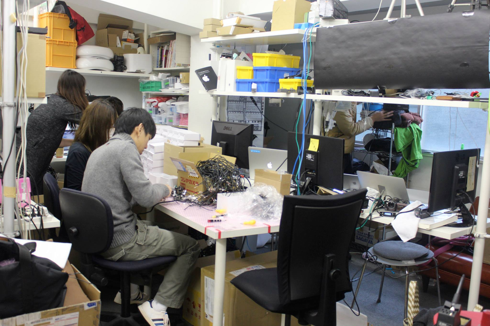

Despite the risk-averse nature of the Japanese culture, the local startup scene has been on the rise. In March 2014, visited Tokyo to learn more about this phenomenon.

## Cerevo

I visited quite a few companies, one of which was Cerevo, a startup that focuses on creating network computer devices. Although Cerevo was still small with only 13 employees and modest offices, it had received a fair amount of local and international success. Unfortunately, not many people are like Tomoya Suzuki, the founder of Cerevo. Tomoya had defied the social norm and conformity of working for an established company in order to go his own way. He was faced with many obstacles throughout his journey trying to "revolutionize the world of consumer electronics". Despite many setbacks, Cerevo has been growing in size and now boasts an office in Redmond, Washington. Their products have received both local and global recognition for their unique connected solutions.

Tomoya Suzuki, founder of Cerevo

Cerevo Headquarters

## SixApart

Another company that left an impression on me was SixApart (6A), a software company that is most known for creating the 'Movable Type' blogware, 'TypePad' blog hosting service, and Vox. SixApart was originally founded as a blog solution provider in San Francisco in 2001. It has 40+ employees in Japan and 3 executives in the US. SixApart is now operated as a Japanese company, and as of 2011, has
been acquired by InfoCom, a Japanese IT company. As with the case of Cerevo, not many people were supportive of SixApart's entrepreneurial ventures. The payoffs may be magnanamus if successful, but the chances of failure are way too high to even attempt to join for most Japanese people. Nobuhiro Seki, who is the president and CEO of SixApart, is optimistic about the future of the company and believes that entrepreneurship in Japan is on the rise and that the 'Maker Movement' will become a big thing in the future.

Nobuhiro Seki, CEO of SixApart

SixApart Headquarters

