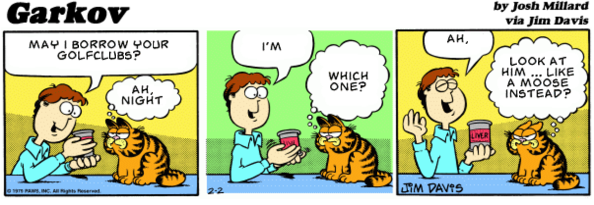
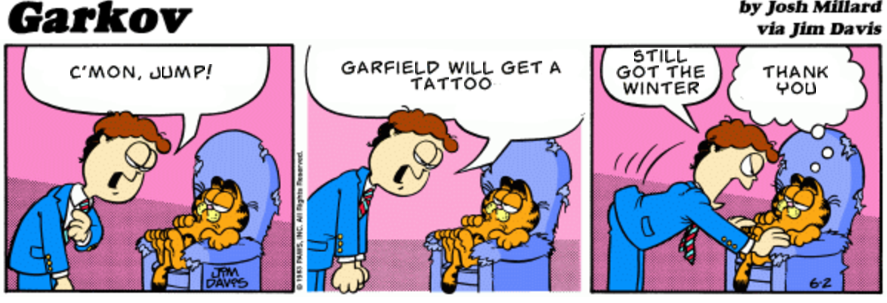

With the rise of automation and machine learning, many programs that predict future instances based on past appearances are popping up. A great deal of these programs utilize the concept of a Markov Chain, which is a model that describes a sequence of possible events in which the probability of each event depends on the state attained in the previous event <sup>[1](http://www.businessdictionary.com/definition/Markov-chain.html)</sup>. A few years ago, a Facebook application called 'What Would I Say?' (that utilized Markov Chains) went viral. It claimed that it could automatically generate Facebook posts that sound like you from studying your previous status posts. While most of the sentences it generated were utterly meaningless, the concept behind it has many useful applications. Beyond generating gibbrish, Markov Chains can generate a large number of spam emails, can help create piano compositions, and can even predict baseball pitches. One humorous implementation of a Markov Chain is [Garkov](http://joshmillard.com/garkov/), which transcripts old Garfield strips (plus some extra code) to make a genuine looking Garfield comic strip.



source: [Garkov](http://joshmillard.com/garkov/)


In this post, I am going to create a basic Markov Chain that attempts to generate text in the same manner as the 'What Would I Say?' application. The model I explain below is quite simple and presumably not very accurate. We could increase its precision by assigning weights to the words. For now, I will stick to the basic model in order to illustrate the concept of Markov Chains.

## Implementation:

Below I illustrate how a Markov Chain works by creating a class conveniently named 'markov':

```
import random
import re

class markov(object):

    '''
    A class that takes in a file and returns a sentence
    of a specified size generated using a Markov Chain
        markov contains 4 functions:
            words_from_file,
            triples,
            model,
            text_generator
    '''

    def __init__(self, file):
        #Empty dictionary to store word occurances
        self.collection = {}
        self.file = open(file)
        self.words = self.words_from_file()
        self.model()
```

I began by reading in a file that contains the words which will serve as the collection from which we choose the next word. I downloaded the full Alice in Wonderland text from [Project Gutenberg](http://www.gutenberg.org/ebooks/11) to use as my file. In order to get the most meaningful results, I transformed all words to lowercase and then only retained the lowercase words and the apostrophes before splitting the text into a list containing all the words in the text.

```        
    def words_from_file(self):

        '''
        Reads in a file, transforms all words to lowercase,
        removes all characters that are not a space or apostrophe,
        and splits all the words individually into a list
            Output: words, a list of words read from the file
        '''

        #Set the cursor to the beginning of the text
        self.file.seek(0)
        text = self.file.read().lower()
        text = re.sub(r'([^\s\w]|_)+', '', text).replace('\n', " ")
        words = text.split()
        return words
```

From the generated word list, I created lists of 'triples' containing every single possible 3 consecutive word combination. This list will be used to implement a second order Markov Chain model. These lists do not necessarily need to be of triples, they can have any number of words; however, the generated text becomes less random as the number of words increases.

```    
    def triples(self):

        '''
        Creates 'triples' of every single combination of 3
        consecutive words from the text
            Output: triple_word, a list of 3 consecutive words
        '''

        #Can't generate if text length is less than 3
        if len(self.words) < 3:
            return

        #Create triples lists
        for i in range(len(self.words) - 2):
            triple_word = (self.words[i], self.words[i+1], self.words[i+2])
            yield triple_word
```

Original sentence:

`Alice was beginning to get very tired of sitting by her sister on the
bank`

Sample output:

`('alice', 'was', 'beginning')('was', 'beginning', 'to')('beginning', 'to', 'get')('to', 'get', 'very')('get', 'very', 'tired')('very', 'tired', 'of')('tired', 'of', 'sitting')=('of', 'sitting', 'by')('sitting', 'by', 'her')('by', 'her', 'sister')('her', 'sister', 'on')('sister', 'on', 'the')('on', 'the', 'bank')`

For each triples list, I then stored the first two words in a list as the key, and the third word as the value in the 'collection' hash table in order to assemble the model. If the combination of two consecutive was already in the table as a key, then the third word would simply be appended to the existing value. As you may infer here, the larger the text we feed into our function, the more 'complete' our model is and as a result, the better it is at generating legible sentences.

```
    def model(self):

        '''
        Takes in generated triples and stores the first two
        words as keys and the third word as their value
        '''

        #Set the key as the first 2 words
        for triple_word in self.triples():
            key = (triple_word[0], triple_word[1])

            #Append the third word if key already exists in the collection
            if key in self.collection:
                self.collection[key].append(triple_word[2])
            #Set key and assign value if key does not already exist in the collection
            else:
                self.collection[key] = [triple_word[2]]

```

Sample output of the hash table (collection):

`{('while', 'the'): ['rest', 'dodo', 'mouse', 'duchess', 'rest', 'mock', 'owl', 'panther', 'lowing'], ('hurried', 'back'): ['to']...}`

Now it is time to define how our model generates a sentence. I decided to start with two consecutive words selected at random from the text. The model would then find these two words in the collection hash table and select the next word at random from the list of values available for that key. The words are stored as values the number of times they appear, making a word that appears more often more likely to be selected. This, of course, is not the best way to weigh the words. We could assign a score for each word based on the number of times is appears as a value for that specific key. For now we will stick to this model; however, alterations could easily be implemented to this code. I then repeated this process with the second word as the first word and the newly selected word as the second word. This process loops until the desired text size is reached. Finally, the selected words are joined into a sentence and outputted.

As an example, if 'while' and 'the' from the sample output above are selected as the first two words, the third word is selected randomly from their set of values. Let's say 'mouse' is selected. The model then assigns 'the' as the first word, and 'mouse' as the second word, and then repeats the process until the desired sentence length is reached.

```

    def text_generator(self, size = 30):

        '''
        Selects 2 consecutive words at random and
        then uses the collection hash table to choose
        the next word. Repeats until desired text length
        is reached
            Input: size, an integer specifying preferred
                   text size (defaults to size = 30)
            Output: A randomly generated string
        '''

        #Select the first 2 consecutive words at random
        index = random.randint(0, len(self.words) - 1)
        first_word = self.words[index]
        next_word = self.words[index + 1]
        sentence = []
        #For the specified size
        for i in range(size - 1):
            #Append the first word to the sentence
            sentence.append(first_word)
            #Reassign both words based on collection dictionary
            first_word, next_word = next_word, random.choice(self.collection[(first_word, next_word)])
        sentence.append(next_word)
        #Join the list to form a sentence
        return ' '.join(sentence)

```

```
markov = markov('alice.txt')
markov.text_generator(25)

```

Sample outputs:


`'again with a teacup in one hand and a crash of broken glass from which she had forgotten the little door so either way get'`

`'with one elbow against the door pray what is the same thing as i get it home when it grunted again and the fall over'`

`'one the cook was leaning over the wig look at the caterpillars making such a thing after a minute or two and the moon memory'`

----------

## Conclusion

Although this implementation yields nonsensical sentences, it proves to us that Markov Chains are rather cool. With a better weight mechanism and a larger word database, this method may be able to generate logical sentences based on one's writing style. The applicability of Markov Chains goes beyond such basic implementations, having been used as the basis of Google's PageRank algorithm, to model thermodynamic processes, and to predict sporting activity scores. Aakash Japi even goes on to humorously say that a Markov Chain can generate a model that poses as a 'real, spam filter-defying Nigerian Prince' in his blog<sup>[3](http://aakashjapi.com/mimicking-writing-style-with-markov-chains/)</sup> .

One implementation of Markov Chains that has caught my interest is [MarkovComposer](http://markov.zx.rs/). Algorithmic composition has been used to generate music for centuries. MarkovComposer is a project that generates piano compositions using a second order Markov Chain to determine the next state based on a current state of 128 notes. All of the transition possibilities are stored in a matrix. Pitch of the notes and spacing between two notes is also stored in the Markov Chain<sup>[2](https://github.com/anbud/MarkovComposer)</sup>. Keep an eye out for my next blog post to see a demonstration of Markov Chain to create a piano 'masterpiece'!

Full code: [Markov Sentence Generator](https://github.com/nadasal/markov_sentence_generator)

------

*References:*

*1 . [Business Dictionary](http://www.businessdictionary.com/definition/Markov-chain.html)*

*2 . [MarkovComposer](https://github.com/anbud/MarkovComposer)*

*3. [aakashjapi Blog](http://aakashjapi.com/mimicking-writing-style-with-markov-chains/)*

*4 . [agiliq Blog](http://agiliq.com/blog/2009/06/generating-pseudo-random-text-with-markov-chains-u/)*
